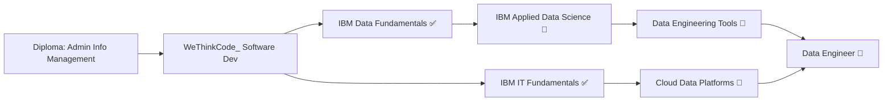

<div align="center">

# 👋 Hey, I'm Amogelang Ngene

### 🔧 Aspiring Data Engineer | 💻 Software Developer | 📊 Data Enthusiast

[](https://www.linkedin.com/in/amglng)
[](mailto:amglng9@gmail.com)
[](https://github.com/amglng)

</div>

---

## 🌟 About Me

```python
class DataEnthusiast:
    def __init__(self):
        self.name = "Amogelang Ngene"
        self.location = "South Africa 🇿🇦"
        self.education = "WeThinkCode_ | Software Development (Final Year)"
        self.passion = "Building robust data pipelines and infrastructure"
        self.currently_learning = ["Data Engineering", "ETL Pipelines", "Cloud Technologies"]
        
    def say_hi(self):
        print("Thanks for dropping by! Let's build something amazing together 🚀")

me = DataEnthusiast()
me.say_hi()
```

I'm a **final-year Software Development student at WeThinkCode_** with a burning passion for **data engineering and building scalable data systems**. With a background in **Administrative Information Management**, I bridge the gap between software engineering and data infrastructure.

### 🎯 What Drives Me
- 🏗️ **Building Data Pipelines** – Creating efficient ETL/ELT processes that scale
- 🔧 **Data Infrastructure** – Designing robust systems for data storage and processing
- 🌱 **Continuous Learning** – Currently pursuing IBM's Applied Data Science certification
- 💡 **Open Source Contribution** – Sharing knowledge through well-documented projects

---

## 🛠️ Tech Arsenal

### 💻 Languages


### 📊 Data Science & Analytics


### 🌐 Web Development


### 🔧 DevOps & Tools


---

## 🚀 Featured Projects

<table>
<tr>
<td width="50%">

### 📊 Data Analysis & Visualization
- **Real-world datasets** with Python
- Data cleaning, transformation & EDA
- Statistical analysis & insights
- Interactive visualizations

**Tech:** Python, Pandas, Matplotlib, Seaborn

</td>
<td width="50%">

### 🏗️ Software Engineering
- Object-oriented design patterns
- RESTful API development
- Problem-solving algorithms
- Test-driven development

**Tech:** Java, Spring Boot, JUnit

</td>
</tr>
<tr>
<td width="50%">

### 🗄️ Database & SQL Projects
- Complex queries & optimizations
- Database design & normalization
- Data aggregation & reporting
- ETL pipelines

**Tech:** PostgreSQL, MySQL, SQLite

</td>
<td width="50%">

### 🌐 Web Applications
- Responsive UI/UX design
- Frontend-backend integration
- Containerized deployments
- CI/CD automation

**Tech:** HTML, CSS, JS, Docker, GitHub Actions

</td>
</tr>
</table>

> 💡 **Explore my repositories** for detailed READMEs, code documentation, and live demos!

---

## 📈 GitHub Stats

<div align="center">


</div>

---

## 🎓 Certifications & Learning Path



### 📜 Completed
✅ **IBM Data Fundamentals** – *January 2025*  
✅ **IBM Information Technology Fundamentals** – *July 2025*  
✅ **Diploma in Administrative Information Management**

### 🔄 In Progress
🟡 **IBM Applied Data Science with Python Professional Certificate**

### 🎯 Next Up
🔜 **Apache Airflow Fundamentals**  
🔜 **AWS Certified Data Engineer Associate**

---

## 💼 What I'm Looking For

I'm seeking opportunities to grow as a:

- 🔧 **Data Engineer** – Building scalable data pipelines and infrastructure
- ☁️ **Cloud Data Engineer** – Leveraging AWS/Azure/GCP for data solutions
- 🏗️ **ETL/ELT Developer** – Designing efficient data transformation workflows
- 📊 **Analytics Engineer** – Creating data models that drive business decisions

**Open to:** Internships, Junior Roles, Collaborative Projects, Open Source Contributions

---

## 🌱 Current Focus

```yaml
Learning:
  - Data Pipeline Architecture
  - Apache Airflow & ETL Orchestration
  - Docker & Container Orchestration
  - Cloud Platforms (AWS/Azure/GCP)
  
Building:
  - End-to-end data pipelines
  - Dockerized data services
  - Automated ETL workflows
  - Data warehouse solutions
  
Reading:
  - "Designing Data-Intensive Applications"
  - "Fundamentals of Data Engineering"
```

---

## 📫 Let's Connect!

I'm always excited to connect with fellow developers, data enthusiasts, and potential collaborators!

<div align="center">

[](https://www.linkedin.com/in/amglng)
[](mailto:amglng9@gmail.com)

### 💬 Open to discussing:
Data Engineering • ETL Pipelines • Cloud Architecture • Software Development • Open Source • Career Opportunities

---

⭐ **If you find my work interesting, consider starring some repos!** ⭐


</div>

---

<div align="center">
  
### 🚀 "Building the bridges between raw data and actionable insights" 🚀

*Built with ❤️ by Amogelang Ngene*

</div>
